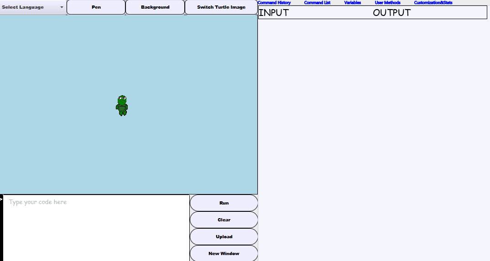

# Description
Slogo Turtle Parser allows users to issue commands in an IDE to directly control virtual turtlebots. It features a full parser of the Slogo command language (with the ability to handle variables, user defined methods, and recursion) which was built using Java.

